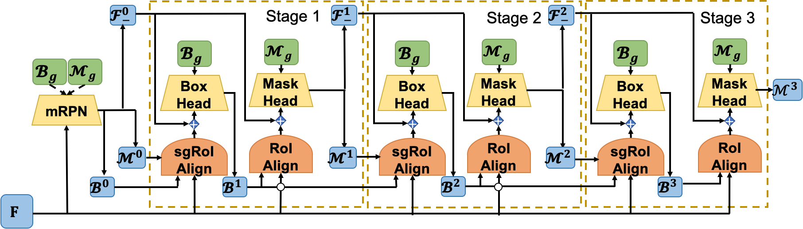

# Deeply Shape-guided Cascade for Instance Segmentation
This repo hosts the code for implementing the DSC algorithms for instance segmentation.

> [**Deeply Shape-guided Cascade for Instance Segmentation**](https://arxiv.org/abs/1911.11263),            
> Hao Ding, Siyuan Qiao, Alan Yuille, Wei Shen   
> In: Proc. IEEE Conference Computer Vision Pattern Recognition(CVPR), 2021  
> *arXiv preprint ([arXiv 1911.11263](https://arxiv.org/abs/1911.11263))*  



## Highlights
- **Imposing shape guidance:**  DSC improved the original HTC baseline by imposing shape guidance both explicitly and implicitly.
- **State-of-the-art performance:** Our best single model based on ResNeXt-101-64x4d + FPN with deformable convolutions achieves **51.8%** in box AP and **45.5%** in mask AP on COCO test-dev (without multi-scale testing)
- **Better improvement for huddled instances:** With shape guidance, DSC's improvement is more significant on images with more huddled instances.

## Installation
This implementation is based on [mmdetection](https://github.com/open-mmlab/mmdetection)(v2.1.0). Please refer to [INSTALL.md](https://github.com/open-mmlab/mmdetection/blob/v2.1.0/docs/install.md) [GET_STARTED.md](https://github.com/open-mmlab/mmdetection/blob/v2.1.0/docs/install.md) for installation and dataset preparation. A list of installed packages information from anaconda is provided in conda_list.txt

## Model Zoo
We provide the following trained models on COCO

Model | Backbone | Multi-scale training | Lr schd | box AP | Mask AP | config | Model
:---: |:---:|:---:|:---:|:---: |:---: |:---: |:---:
F-DSC| R50-FPN | No | 1x | 44.5 | 39.5 | [config](configs/dsc/fast_dsc_r50_fpn_1x_coco.py) | [download](https://www.icloud.com/iclouddrive/05yKomhpHgJtq0id3c_w0DfsA#f_dsc_r50_fpn_1x_coco)
DSC| R50-FPN | No | 1x | 44.7 | 39.4 | [config](configs/dsc/dsc_r50_fpn_1x_coco.py) | [download](https://www.icloud.com/iclouddrive/0n6D3LmBoQj04riZf8OpyuO7g#dsc_r50_fpn_1x_coco)
DSC| R50-FPN | No | 20e | 45.8 | 40.1 | [config](configs/dsc/dsc_r50_fpn_20e_coco.py) | [download](https://www.icloud.com/iclouddrive/04KDNWYuoO5pDkklVASW3GKJA#dsc_r50_fpn_20e_coco)
DSC| R101-FPN | No | 20e | 46.6 | 40.7 | [config](configs/dsc/dsc_r101_fpn_20e_coco.py) | [download](https://www.icloud.com/iclouddrive/0HZA9SZhQoLTn2tmLE9a3FpRA#dsc_r101_fpn_20e_coco)
DSC| X101-32x4d-FPN | No | 20e | 48.0 | 41.9 | [config](configs/dsc/dsc_x101_32x4d_fpn_20e_coco.py) | [download](https://www.icloud.com/iclouddrive/0550mLVMlTdYzldo0G72swJZA#dsc_x101_32x4d_fpn_20e_coco)
DSC| X101-64x4d-DCN-FPN | Yes | 20e | 51.4 | 44.9 | [config](configs/dsc/dsc_x101_64x4d_fpn_dconv_c3-c5_mstrain_400_1400_16x1_20e_coco.py) | [download](https://www.icloud.com/iclouddrive/0DXqitbQT0s2FMBg4n6-0R9CQ#dsc_x101_64x4d_fpn_dconv_c3-c5_mstrain_400_1400_16x1_20e_coco)

## Usage

### Train with multiple GPUs
    ./tools/dist_train.sh ${CONFIG_FILE} ${GPU_NUM}

    Example: 
    ./tools/dist_train.sh configs/dsc/fast_dsc_r50_fpn_1x_coco.py  8

### Train with single GPU
    python tools/train.py ${CONFIG_FILE}
    
    Example:
    python tools/train.py configs/dsc/fast_dsc_r50_fpn_1x_coco.py

### Testing
    # multi-gpu testing
    ./tools/dist_test.sh ${CONFIG_FILE} ${CHECKPOINT_FILE} ${GPU_NUM} --out  ${OUTPUT_FILE} --eval bbox segm
    
    Example: 
    ./tools/dist_test.sh configs/dsc/fast_dsc_r50_fpn_1x_coco.py  f_dsc_r50_fpn_1x_coco.pth 8 --out results.pkl --eval bbox segm

    # single-gpu testing
    python tools/test_ins.py ${CONFIG_FILE} ${CHECKPOINT_FILE} --show --out  ${OUTPUT_FILE} --eval segm
    
    Example: 
    python tools/test_ins.py configs/dsc/fast_dsc_r50_fpn_1x_coco.py  f_dsc_r50_fpn_1x_coco.pth --out  results.pkl --eval bbox segm

## Citations
Please consider citing our papers in your publications if this repo helps you. 
```
@inproceedings{ding2021dsc,
  title     =  {Deeply Shape-guided Cascade for Instance Segmentation},
  author    =  {Ding, Hao and Qiao, Siyuan and Yuille, Alan and Shen, Wei},
  booktitle =  {IEEE Conf. Comput. Vis. Pattern Recog. (CVPR)},
  year      =  {2021}
}
```

## License
For academic use, this project is licensed under the 2-clause BSD License - see the LICENSE file for details. For commercial use, please contact Hao Ding ([email](hding15@jhu.edu)) and  [Wei Shen](https://shenwei1231.github.io/).
